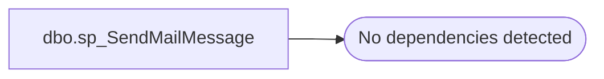

# dbo.sp_SendMailMessage

**Database:** msdb  
**Server:** bedrockdb02  

## Architecture Diagram



## Table Dependencies

_No table references detected._

## Stored Procedure Code

```sql
-- sp_SendMailMessage : Sends a request on the mail items SSB queue
CREATE PROCEDURE sp_SendMailMessage
    @contract_name sysname, -- Name of contract
    @message_type sysname,  -- Type of message
    @request varchar(max) -- XML message to send
  WITH EXECUTE AS 'dbo'
AS

SET NOCOUNT ON

DECLARE @conversationHandle uniqueidentifier;
DECLARE @error int

-- Start a conversation with the remote service
BEGIN DIALOG  @conversationHandle
    FROM SERVICE    [InternalMailService]
    TO SERVICE      'ExternalMailService'
    ON CONTRACT     @contract_name
    WITH ENCRYPTION=OFF

-- Check error
SET @error = @@ERROR
IF @error <> 0
BEGIN
    RETURN @error
END

-- Send message
;SEND ON CONVERSATION @conversationHandle MESSAGE TYPE @message_type (@request)

-- Check error
SET @error = @@ERROR
IF @error <> 0
BEGIN
    RETURN @error
END

RETURN 0
```

