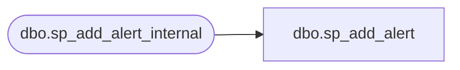

# dbo.sp_add_alert

**Database:** msdb  
**Server:** bedrockdb02  

## Architecture Diagram



## Table Dependencies

| Referenced Table |
|---|
| dbo.sp_add_alert_internal |

## Stored Procedure Code

```sql
CREATE PROCEDURE sp_add_alert
  @name                         sysname,
  @message_id                   INT              = 0,
  @severity                     INT              = 0,
  @enabled                      TINYINT          = 1,
  @delay_between_responses      INT              = 0,
  @notification_message         NVARCHAR(512)    = NULL,
  @include_event_description_in TINYINT          = 5,    -- 0 = None, 1 = Email, 2 = Pager, 4 = NetSend, 7 = All
  @database_name                sysname          = NULL,
  @event_description_keyword    NVARCHAR(100)    = NULL,
  @job_id                       UNIQUEIDENTIFIER = NULL, -- If provided must NOT also provide job_name
  @job_name                     sysname          = NULL, -- If provided must NOT also provide job_id
  @raise_snmp_trap              TINYINT          = 0,
  @performance_condition        NVARCHAR(512)    = NULL, -- New for 7.0
  @category_name                sysname          = NULL, -- New for 7.0
  @wmi_namespace                sysname             = NULL, -- New for 9.0
  @wmi_query                    NVARCHAR(512)     = NULL  -- New for 9.0
AS
BEGIN
  DECLARE @verify_alert         INT
  
  --Always verify alerts before adding
  SELECT @verify_alert = 1

  EXECUTE msdb.dbo.sp_add_alert_internal @name,
                                         @message_id,
                                         @severity,
                                         @enabled,
                                         @delay_between_responses,
                                         @notification_message,
                                         @include_event_description_in,
                                         @database_name,
                                         @event_description_keyword,
                                         @job_id,
                                         @job_name,
                                         @raise_snmp_trap,
                                         @performance_condition,
                                         @category_name,
                                         @wmi_namespace,
                                         @wmi_query,
                                         @verify_alert
END
```

