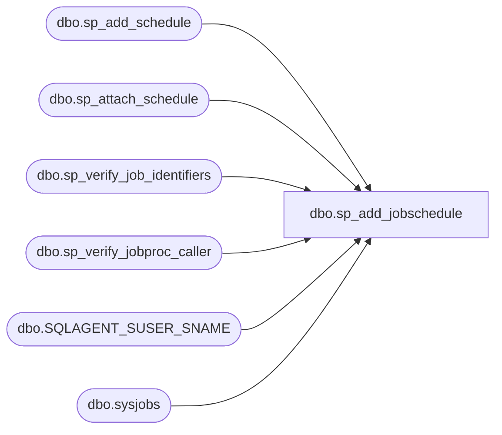

# dbo.sp_add_jobschedule

**Database:** msdb  
**Server:** bedrockdb02  

## Architecture Diagram



## Table Dependencies

| Referenced Table |
|---|
| dbo.sp_add_schedule |
| dbo.sp_attach_schedule |
| dbo.sp_verify_job_identifiers |
| dbo.sp_verify_jobproc_caller |
| dbo.SQLAGENT_SUSER_SNAME |
| dbo.sysjobs |

## Stored Procedure Code

```sql
CREATE PROCEDURE sp_add_jobschedule                 -- This SP is deprecated. Use sp_add_schedule and sp_attach_schedule.
  @job_id                 UNIQUEIDENTIFIER = NULL,
  @job_name               sysname          = NULL,
  @name                   sysname,
  @enabled                TINYINT          = 1,
  @freq_type              INT              = 1,
  @freq_interval          INT              = 0,
  @freq_subday_type       INT              = 0,
  @freq_subday_interval   INT              = 0,
  @freq_relative_interval INT              = 0,
  @freq_recurrence_factor INT              = 0,
  @active_start_date      INT              = NULL,     -- sp_verify_schedule assigns a default
  @active_end_date        INT              = 99991231, -- December 31st 9999
  @active_start_time      INT              = 000000,   -- 12:00:00 am
  @active_end_time        INT              = 235959,    -- 11:59:59 pm
  @schedule_id            INT              = NULL  OUTPUT,
  @automatic_post         BIT              = 1,         -- If 1 will post notifications to all tsx servers to that run this job
  @schedule_uid           UNIQUEIDENTIFIER = NULL OUTPUT
AS
BEGIN
  DECLARE @retval           INT
  DECLARE @owner_login_name sysname

  SET NOCOUNT ON

  -- Check authority (only SQLServerAgent can add a schedule to a non-local job)
  EXECUTE @retval = sp_verify_jobproc_caller @job_id = @job_id, @program_name = N'SQLAgent%'
  IF (@retval <> 0)
    RETURN(@retval)

  -- Check that we can uniquely identify the job
  EXECUTE @retval = sp_verify_job_identifiers '@job_name',
                                              '@job_id',
                                               @job_name OUTPUT,
                                               @job_id   OUTPUT
  IF (@retval <> 0)
    RETURN(1) -- Failure

  -- Get the owner of the job. Prior to resusable schedules the job owner also owned the schedule
  SELECT @owner_login_name = dbo.SQLAGENT_SUSER_SNAME(owner_sid)
  FROM   sysjobs
  WHERE  (job_id = @job_id) 

  IF ((ISNULL(IS_SRVROLEMEMBER(N'sysadmin'), 0) <> 1) AND
      (SUSER_SNAME() <> @owner_login_name))
  BEGIN
   RAISERROR(14525, -1, -1)
   RETURN(1) -- Failure
  END

  -- Check authority (only SQLServerAgent can add a schedule to a non-local job)
  EXECUTE @retval = sp_verify_jobproc_caller @job_id = @job_id, @program_name = N'SQLAgent%'
  IF (@retval <> 0)
    RETURN(@retval)

  -- Add the schedule first
  EXECUTE @retval = msdb.dbo.sp_add_schedule @schedule_name          = @name,
                                             @enabled                = @enabled,
                                             @freq_type              = @freq_type,
                                             @freq_interval          = @freq_interval,
                                             @freq_subday_type       = @freq_subday_type,
                                             @freq_subday_interval   = @freq_subday_interval,
                                             @freq_relative_interval = @freq_relative_interval,
                                             @freq_recurrence_factor = @freq_recurrence_factor,
                                             @active_start_date      = @active_start_date,
                                             @active_end_date        = @active_end_date,
                                             @active_start_time      = @active_start_time,
                                             @active_end_time        = @active_end_time,
                                             @owner_login_name       = @owner_login_name,
                                             @schedule_uid           = @schedule_uid OUTPUT,
                                             @schedule_id            = @schedule_id  OUTPUT
  IF (@retval <> 0)
    RETURN(1) -- Failure
 
 
  EXECUTE @retval = msdb.dbo.sp_attach_schedule @job_id           = @job_id, 
                                                @job_name         = NULL,
                                                @schedule_id      = @schedule_id,
                                                @schedule_name    = NULL,
                                                @automatic_post   = @automatic_post
  IF (@retval <> 0)
    RETURN(1) -- Failure
    
    

  RETURN(@retval) -- 0 means success
END
```

