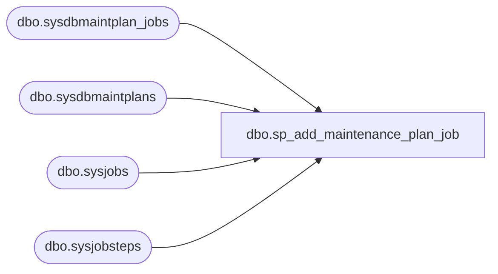

# dbo.sp_add_maintenance_plan_job

**Database:** msdb  
**Server:** bedrockdb02  

## Architecture Diagram



## Table Dependencies

| Referenced Table |
|---|
| dbo.sysdbmaintplan_jobs |
| dbo.sysdbmaintplans |
| dbo.sysjobs |
| dbo.sysjobsteps |

## Stored Procedure Code

```sql
CREATE PROCEDURE sp_add_maintenance_plan_job
  @plan_id UNIQUEIDENTIFIER,
  @job_id  UNIQUEIDENTIFIER
AS
BEGIN
  DECLARE @syserr varchar(100)
  /*check if the @plan_id is valid*/
  IF (NOT EXISTS(SELECT plan_id
                 FROM msdb.dbo.sysdbmaintplans
                 WHERE plan_id=@plan_id))
  BEGIN
    SELECT @syserr=CONVERT(VARCHAR(100),@plan_id)
    RAISERROR(14262,-1,-1,'@plan_id',@syserr)
    RETURN(1)
  END
  /*check if the @job_id is valid*/
  IF (NOT EXISTS(SELECT job_id
                 FROM msdb.dbo.sysjobs
                 WHERE job_id=@job_id))
  BEGIN
    SELECT @syserr=CONVERT(VARCHAR(100),@job_id)
    RAISERROR(14262,-1,-1,'@job_id',@syserr)
    RETURN(1)
  END
  /*check if the job has at least one step calling xp_sqlmaint*/
  DECLARE @maxind INT
  SELECT @maxind=(SELECT MAX(CHARINDEX('xp_sqlmaint', command))
                FROM  msdb.dbo.sysjobsteps
                WHERE @job_id=job_id)
  IF (@maxind<=0)
  BEGIN
    /*print N'Warning: The job is not for maitenance plan.' -- will add the new sysmessage here*/
    SELECT @syserr=CONVERT(VARCHAR(100),@job_id)
    RAISERROR(14199,-1,-1,@syserr)
    RETURN(1)
  END
  INSERT INTO msdb.dbo.sysdbmaintplan_jobs(plan_id,job_id) VALUES (@plan_id, @job_id) --don't have to check duplicate here
END
```

