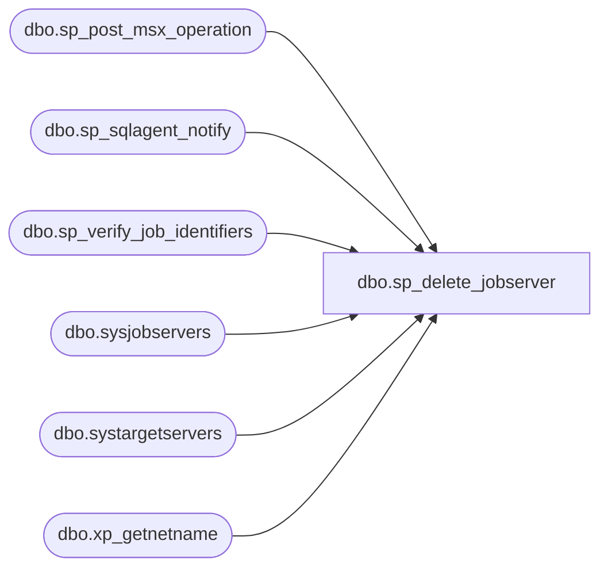

# dbo.sp_delete_jobserver

**Database:** msdb  
**Server:** bedrockdb02  

## Architecture Diagram



## Table Dependencies

| Referenced Table |
|---|
| dbo.sp_post_msx_operation |
| dbo.sp_sqlagent_notify |
| dbo.sp_verify_job_identifiers |
| dbo.sysjobservers |
| dbo.systargetservers |
| dbo.xp_getnetname |

## Stored Procedure Code

```sql
CREATE PROCEDURE sp_delete_jobserver
  @job_id      UNIQUEIDENTIFIER = NULL, -- Must provide either this or job_name
  @job_name    sysname          = NULL, -- Must provide either this or job_id
  @server_name sysname
AS
BEGIN
  DECLARE @retval             INT
  DECLARE @server_id          INT
  DECLARE @local_machine_name sysname

  SET NOCOUNT ON

  -- Remove any leading/trailing spaces from parameters
  SELECT @server_name = LTRIM(RTRIM(@server_name))

  IF (UPPER(@server_name collate SQL_Latin1_General_CP1_CS_AS) = '(LOCAL)')
    SELECT @server_name = UPPER(CONVERT(sysname, SERVERPROPERTY('ServerName')))

  EXECUTE @retval = sp_verify_job_identifiers '@job_name',
                                              '@job_id',
                                               @job_name OUTPUT,
                                               @job_id   OUTPUT
  IF (@retval <> 0)
    RETURN(1) -- Failure

  -- First, check if the server is the local server
  EXECUTE @retval = master.dbo.xp_getnetname @local_machine_name OUTPUT
  IF (@retval <> 0)
    RETURN(1) -- Failure
  IF (@local_machine_name IS NOT NULL) AND (UPPER(@server_name) = UPPER(@local_machine_name))
    SELECT @server_name = UPPER(CONVERT(sysname, SERVERPROPERTY('ServerName')))

  -- Check server name
  IF (UPPER(@server_name) <> UPPER(CONVERT(sysname, SERVERPROPERTY('ServerName'))))
  BEGIN
    SELECT @server_id = server_id
    FROM msdb.dbo.systargetservers
    WHERE (UPPER(server_name) = @server_name)
    IF (@server_id IS NULL)
    BEGIN
      RAISERROR(14262, -1, -1, '@server_name', @server_name)
      RETURN(1) -- Failure
    END
  END
  ELSE
    SELECT @server_id = 0

  -- Check that the job is indeed targeted at the server
  IF (NOT EXISTS (SELECT *
                  FROM msdb.dbo.sysjobservers
                  WHERE (job_id = @job_id)
                    AND (server_id = @server_id)))
  BEGIN
    RAISERROR(14270, -1, -1, @job_name, @server_name)
    RETURN(1) -- Failure
  END

  -- Instruct the deleted server to purge the job
  -- NOTE: We must do this BEFORE we delete the sysjobservers row
  EXECUTE @retval = sp_post_msx_operation 'DELETE', 'JOB', @job_id, @server_name

  -- Delete the sysjobservers row
  DELETE FROM msdb.dbo.sysjobservers
  WHERE (job_id = @job_id)
    AND (server_id = @server_id)

  -- We used to change the category_id to 0 when removing the last job server
  -- from a job. We no longer do this.
--  IF (NOT EXISTS (SELECT *
--                  FROM msdb.dbo.sysjobservers
--                  WHERE (job_id = @job_id)))
--  BEGIN
--    UPDATE msdb.dbo.sysjobs
--    SET category_id = 0 -- [Uncategorized (Local)]
--    WHERE (job_id = @job_id)
--  END

  -- If the job is local, make sure that SQLServerAgent removes it from cache
  IF (@server_id = 0)
  BEGIN
    EXECUTE msdb.dbo.sp_sqlagent_notify @op_type     = N'J',
                                        @job_id      = @job_id,
                                        @action_type = N'D'
  END

  RETURN(@retval) -- 0 means success
END
```

