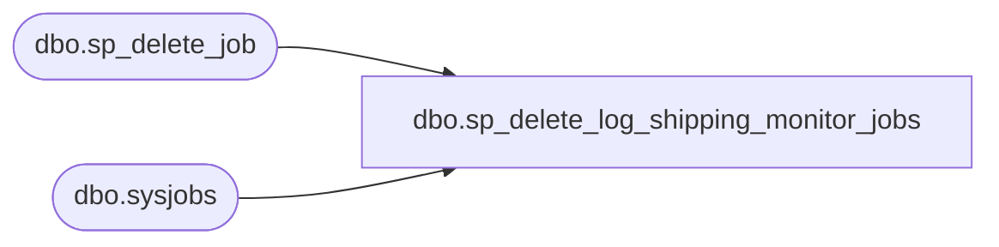

# dbo.sp_delete_log_shipping_monitor_jobs

**Database:** msdb  
**Server:** bedrockdb02  

## Architecture Diagram



## Table Dependencies

| Referenced Table |
|---|
| dbo.sp_delete_job |
| dbo.sysjobs |

## Stored Procedure Code

```sql
CREATE PROCEDURE sp_delete_log_shipping_monitor_jobs AS
BEGIN
  DECLARE @backup_job_name sysname
  SET NOCOUNT ON
  SET @backup_job_name = N'Log Shipping Alert Job - Backup'
  IF (EXISTS (SELECT * FROM msdb.dbo.sysjobs WHERE name = @backup_job_name))
    EXECUTE msdb.dbo.sp_delete_job @job_name = N'Log Shipping Alert Job - Backup'

  DECLARE @restore_job_name sysname
  SET @restore_job_name = 'Log Shipping Alert Job - Restore'
  IF (EXISTS (SELECT * FROM msdb.dbo.sysjobs WHERE name = @restore_job_name))
    EXECUTE msdb.dbo.sp_delete_job @job_name = N'Log Shipping Alert Job - Restore'
END
```

