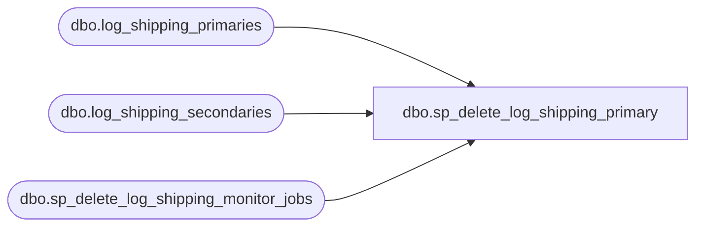

# dbo.sp_delete_log_shipping_primary

**Database:** msdb  
**Server:** bedrockdb02  

## Architecture Diagram



## Table Dependencies

| Referenced Table |
|---|
| dbo.log_shipping_primaries |
| dbo.log_shipping_secondaries |
| dbo.sp_delete_log_shipping_monitor_jobs |

## Stored Procedure Code

```sql
CREATE PROCEDURE sp_delete_log_shipping_primary 
  @primary_server_name sysname,
  @primary_database_name sysname,
  @delete_secondaries BIT = 0
AS BEGIN
  DECLARE @primary_id INT

  SET NOCOUNT ON

  SELECT @primary_id = primary_id 
    FROM msdb.dbo.log_shipping_primaries 
    WHERE primary_server_name = @primary_server_name AND primary_database_name = @primary_database_name
  IF (@primary_id IS NULL)
    RETURN (0)

  BEGIN TRANSACTION
  IF (EXISTS (SELECT * FROM msdb.dbo.log_shipping_secondaries WHERE primary_id = @primary_id))
  BEGIN
    IF (@delete_secondaries = 0)
    BEGIN
      RAISERROR (14429,-1,-1)
      goto rollback_quit
    END
    DELETE FROM msdb.dbo.log_shipping_secondaries WHERE primary_id = @primary_id
    IF (@@ERROR <> 0)
      GOTO rollback_quit
  END
  DELETE FROM msdb.dbo.log_shipping_primaries WHERE primary_id = @primary_id
  IF (@@ERROR <> 0)
    GOTO rollback_quit

  COMMIT TRANSACTION
  DECLARE @i INT
  SELECT @i = COUNT(*) FROM msdb.dbo.log_shipping_primaries
  IF (@i=0)
    EXECUTE msdb.dbo.sp_delete_log_shipping_monitor_jobs
  RETURN (0)

rollback_quit:
  ROLLBACK TRANSACTION
  RETURN(1) -- error
END
```

