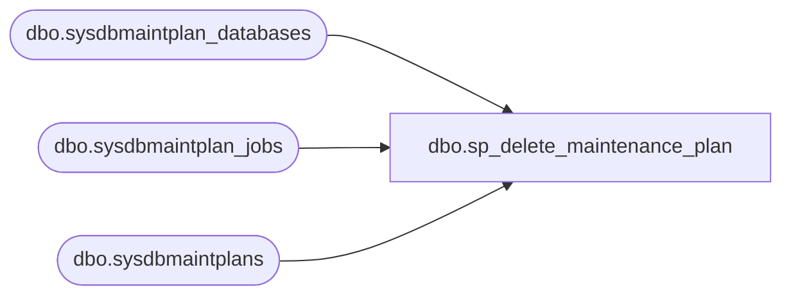

# dbo.sp_delete_maintenance_plan

**Database:** msdb  
**Server:** bedrockdb02  

## Architecture Diagram



## Table Dependencies

| Referenced Table |
|---|
| dbo.sysdbmaintplan_databases |
| dbo.sysdbmaintplan_jobs |
| dbo.sysdbmaintplans |

## Stored Procedure Code

```sql
CREATE PROCEDURE sp_delete_maintenance_plan
  @plan_id UNIQUEIDENTIFIER
AS
BEGIN
  /*check if the plan_id is valid*/
  IF (NOT EXISTS(SELECT *
                 FROM sysdbmaintplans
                 WHERE plan_id=@plan_id))
  BEGIN
    DECLARE @syserr VARCHAR(100)
    SELECT @syserr=CONVERT(VARCHAR(100),@plan_id)
    RAISERROR(14262,-1,-1,'@plan_id',@syserr)
    RETURN(1)
  END
  /* clean the related records in sysdbmaintplan_database */
  DELETE FROM msdb.dbo.sysdbmaintplan_databases
  WHERE plan_id=@plan_id
  /* clean the related records in sysdbmaintplan_jobs*/
  DELETE FROM msdb.dbo.sysdbmaintplan_jobs
  WHERE plan_id=@plan_id
  /* clean sysdbmaintplans */
  DELETE FROM msdb.dbo.sysdbmaintplans
  WHERE  plan_id= @plan_id
END
```

