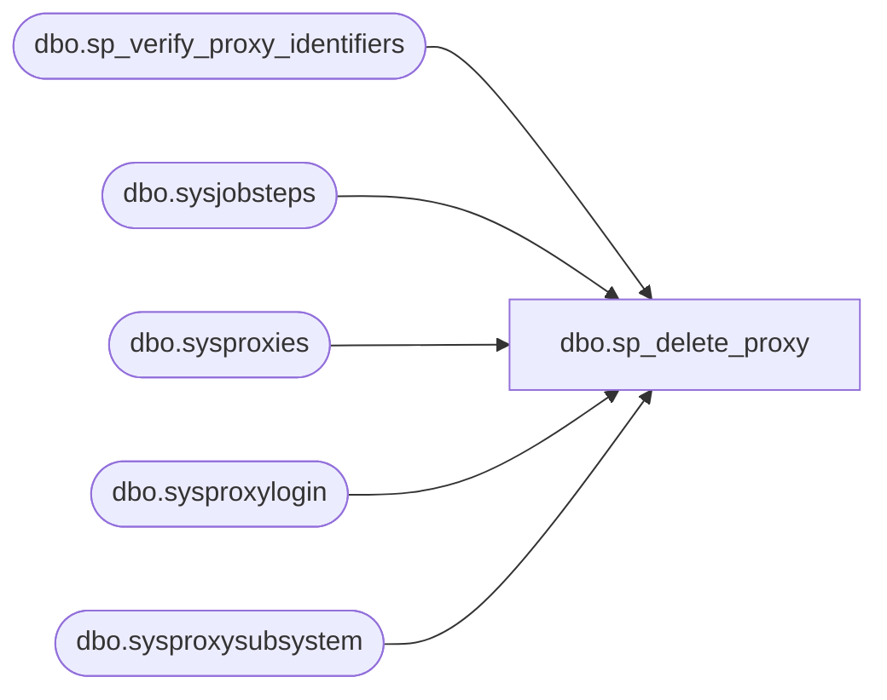

# dbo.sp_delete_proxy

**Database:** msdb  
**Server:** bedrockdb02  

## Architecture Diagram



## Table Dependencies

| Referenced Table |
|---|
| dbo.sp_verify_proxy_identifiers |
| dbo.sysjobsteps |
| dbo.sysproxies |
| dbo.sysproxylogin |
| dbo.sysproxysubsystem |

## Stored Procedure Code

```sql
CREATE PROCEDURE dbo.sp_delete_proxy
   @proxy_id      int = NULL,
   @proxy_name    sysname = NULL
   -- must specify only one of above parameters to identify the proxy
AS
BEGIN
   DECLARE @retval   INT
   SET NOCOUNT ON
    
   EXECUTE @retval = sp_verify_proxy_identifiers '@proxy_name',
                                                  '@proxy_id',
                                                   @proxy_name OUTPUT,
                                                   @proxy_id   OUTPUT
    IF (@retval <> 0)
      RETURN(1) -- Failure

   --no jobsteps should use this proxy
   IF EXISTS (SELECT * FROM sysjobsteps 
            WHERE @proxy_id = proxy_id)
   BEGIN
      RAISERROR(14518, -1, -1, @proxy_id)
      RETURN(1) -- Failure
   END

    BEGIN TRANSACTION
      --delete any association between subsystems and this proxy 
      DELETE sysproxysubsystem
      WHERE  proxy_id = @proxy_id
       
      --delete any association between logins and this proxy 
      DELETE sysproxylogin
      WHERE  proxy_id = @proxy_id

      -- delete the entry in sysproxies table
      DELETE sysproxies
      WHERE proxy_id = @proxy_id

    COMMIT
   RETURN(0)
END
```

