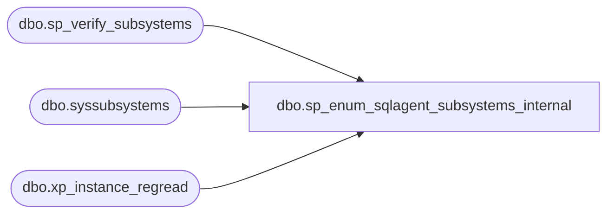

# dbo.sp_enum_sqlagent_subsystems_internal

**Database:** msdb  
**Server:** bedrockdb02  

## Architecture Diagram



## Table Dependencies

| Referenced Table |
|---|
| dbo.sp_verify_subsystems |
| dbo.syssubsystems |
| dbo.xp_instance_regread |

## Stored Procedure Code

```sql
CREATE PROCEDURE sp_enum_sqlagent_subsystems_internal
   @syssubsytems_refresh_needed BIT = 0
AS
BEGIN
  DECLARE @retval INT
  SET NOCOUNT ON
  -- this call will populate subsystems table if necessary
  EXEC @retval = msdb.dbo.sp_verify_subsystems @syssubsytems_refresh_needed
  IF @retval <> 0
     RETURN(@retval)

  -- Check if replication is installed
  DECLARE @replication_installed INT
  EXECUTE master.dbo.xp_instance_regread N'HKEY_LOCAL_MACHINE',
                                         N'SOFTWARE\Microsoft\MSSQLServer\Replication',
                                         N'IsInstalled',
                                         @replication_installed OUTPUT,
                                         N'no_output'
  SELECT @replication_installed = ISNULL(@replication_installed, 0)

  IF @replication_installed = 0
      SELECT  subsystem,
            description = FORMATMESSAGE(description_id),
            subsystem_dll,
            agent_exe,
            start_entry_point,
            event_entry_point,
            stop_entry_point,
            max_worker_threads,
            subsystem_id
      FROM syssubsystems
      WHERE (subsystem NOT IN (N'Distribution', N'LogReader', N'Merge', N'Snapshot', N'QueueReader'))
      ORDER by subsystem
   ELSE
      SELECT  subsystem,
            description = FORMATMESSAGE(description_id),
            subsystem_dll,
            agent_exe,
            start_entry_point,
            event_entry_point,
            stop_entry_point,
            max_worker_threads,
            subsystem_id
      FROM syssubsystems
      ORDER by subsystem_id
      
  RETURN(0)      
END
```

