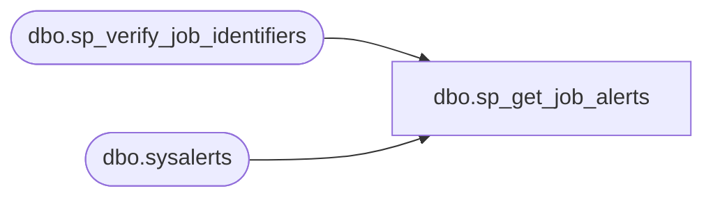

# dbo.sp_get_job_alerts

**Database:** msdb  
**Server:** bedrockdb02  

## Architecture Diagram



## Table Dependencies

| Referenced Table |
|---|
| dbo.sp_verify_job_identifiers |
| dbo.sysalerts |

## Stored Procedure Code

```sql
CREATE PROCEDURE sp_get_job_alerts
  @job_id   UNIQUEIDENTIFIER = NULL,
  @job_name sysname          = NULL
AS
BEGIN
  DECLARE @retval INT

  EXECUTE @retval = sp_verify_job_identifiers '@job_name',
                                              '@job_id',
                                               @job_name OUTPUT,
                                               @job_id   OUTPUT
  IF (@retval <> 0)
    RETURN(1) -- Failure

  SELECT id,
         name,
         enabled,
       type = CASE ISNULL(performance_condition, '!')
         WHEN '!' THEN 1              -- SQL Server event alert
         ELSE CASE event_id
            WHEN 8 THEN 3          -- WMI event alert
            ELSE 2                    -- SQL Server performance condition alert
         END
       END
  FROM msdb.dbo.sysalerts
  WHERE (job_id = @job_id)

  RETURN(0) -- Success
END
```

