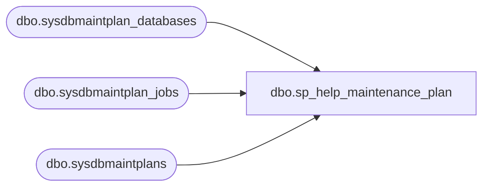

# dbo.sp_help_maintenance_plan

**Database:** msdb  
**Server:** bedrockdb02  

## Architecture Diagram



## Table Dependencies

| Referenced Table |
|---|
| dbo.sysdbmaintplan_databases |
| dbo.sysdbmaintplan_jobs |
| dbo.sysdbmaintplans |

## Stored Procedure Code

```sql
CREATE PROCEDURE sp_help_maintenance_plan
  @plan_id UNIQUEIDENTIFIER = NULL
AS
BEGIN
  IF (@plan_id IS NOT NULL)
    BEGIN
      /*return the information about the plan itself*/
      SELECT *
      FROM msdb.dbo.sysdbmaintplans
      WHERE plan_id=@plan_id
      /*return the information about databases this plan defined on*/
      SELECT database_name
      FROM msdb.dbo.sysdbmaintplan_databases
      WHERE plan_id=@plan_id
      /*return the information about the jobs that relating to the plan*/
      SELECT job_id
      FROM msdb.dbo.sysdbmaintplan_jobs
      WHERE plan_id=@plan_id
    END
  ELSE
    BEGIN
      SELECT *
      FROM msdb.dbo.sysdbmaintplans
    END
END
```

