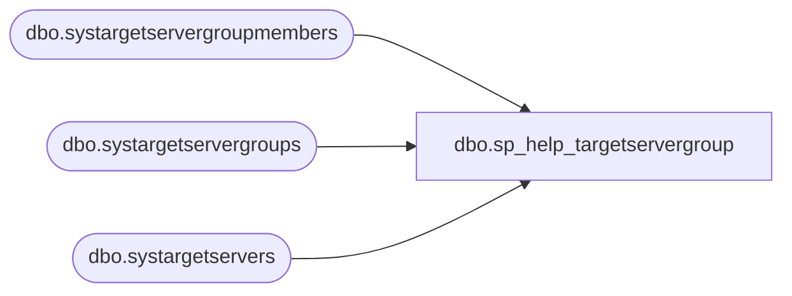

# dbo.sp_help_targetservergroup

**Database:** msdb  
**Server:** bedrockdb02  

## Architecture Diagram



## Table Dependencies

| Referenced Table |
|---|
| dbo.systargetservergroupmembers |
| dbo.systargetservergroups |
| dbo.systargetservers |

## Stored Procedure Code

```sql
CREATE PROCEDURE sp_help_targetservergroup
  @name sysname = NULL
AS
BEGIN
  DECLARE @servergroup_id INT

  SET NOCOUNT ON

  -- Remove any leading/trailing spaces from parameters
  SELECT @name = LTRIM(RTRIM(@name))

  IF (@name IS NULL)
  BEGIN
    -- Show all groups
    SELECT servergroup_id, name
    FROM msdb.dbo.systargetservergroups
    RETURN(@@error) -- 0 means success
  END
  ELSE
  BEGIN
    -- Check if the group exists
    SELECT @servergroup_id = servergroup_id
    FROM msdb.dbo.systargetservergroups
    WHERE (name = @name)

    IF (@servergroup_id IS NULL)
    BEGIN
      RAISERROR(14262, -1, -1, '@name', @name)
      RETURN(1) -- Failure
    END

    -- Return the members of the group
    SELECT sts.server_id,
           sts.server_name
    FROM msdb.dbo.systargetservers sts,
         msdb.dbo.systargetservergroupmembers stsgm
    WHERE (stsgm.servergroup_id = @servergroup_id)
      AND (stsgm.server_id = sts.server_id)

    RETURN(@@error) -- 0 means success
  END
END
```

