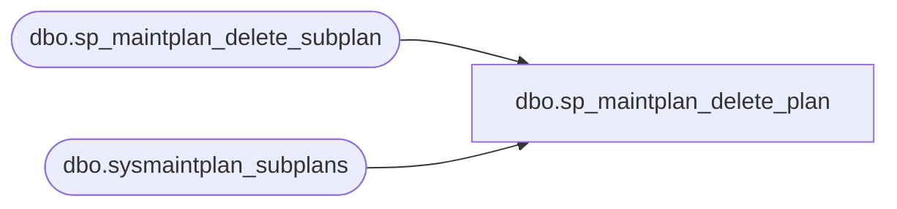

# dbo.sp_maintplan_delete_plan

**Database:** msdb  
**Server:** bedrockdb02  

## Architecture Diagram



## Table Dependencies

| Referenced Table |
|---|
| dbo.sp_maintplan_delete_subplan |
| dbo.sysmaintplan_subplans |

## Stored Procedure Code

```sql
CREATE PROCEDURE sp_maintplan_delete_plan
    @plan_id   UNIQUEIDENTIFIER
AS
BEGIN
   SET NOCOUNT ON

   DECLARE @sp_id UNIQUEIDENTIFIER
    DECLARE @retval     INT

    SET @retval = 0

   --Loop through Subplans
   DECLARE sp CURSOR LOCAL FOR 
        SELECT subplan_id 
        FROM msdb.dbo.sysmaintplan_subplans 
        WHERE plan_id = @plan_id FOR READ ONLY

   OPEN sp
   FETCH NEXT FROM sp INTO @sp_id
   WHILE @@FETCH_STATUS = 0
   BEGIN 
     EXECUTE @retval = sp_maintplan_delete_subplan @subplan_id = @sp_id
      IF(@retval <> 0)
        BREAK

     FETCH NEXT FROM sp INTO @sp_id
   END
   CLOSE sp
   DEALLOCATE sp

    RETURN (@retval)
END
```

