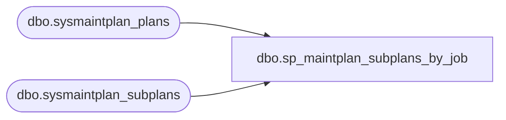

# dbo.sp_maintplan_subplans_by_job

**Database:** msdb  
**Server:** bedrockdb02  

## Architecture Diagram



## Table Dependencies

| Referenced Table |
|---|
| dbo.sysmaintplan_plans |
| dbo.sysmaintplan_subplans |

## Stored Procedure Code

```sql
-- If the given job_id is associated with a maintenance plan,
-- then matching entries from sysmaintplan_subplans are returned.
CREATE PROCEDURE sp_maintplan_subplans_by_job
    @job_id  UNIQUEIDENTIFIER
AS
BEGIN
    select plans.name as 'plan_name', plans.id as 'plan_id', subplans.subplan_name, subplans.subplan_id
    from sysmaintplan_plans plans, sysmaintplan_subplans subplans
    where  plans.id = subplans.plan_id
    and (job_id = @job_id
         or msx_job_id = @job_id)
    order by subplans.plan_id, subplans.subplan_id
END
```

