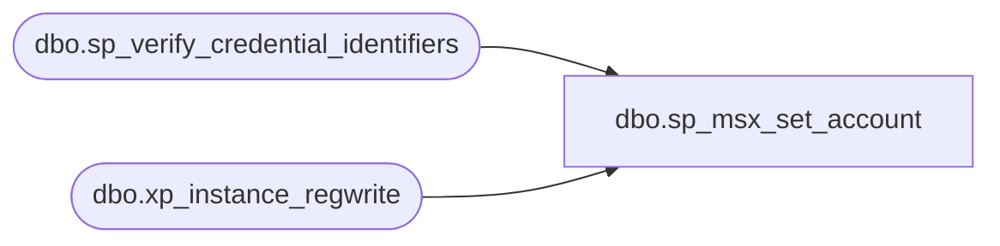

# dbo.sp_msx_set_account

**Database:** msdb  
**Server:** bedrockdb02  

## Architecture Diagram



## Table Dependencies

| Referenced Table |
|---|
| dbo.sp_verify_credential_identifiers |
| dbo.xp_instance_regwrite |

## Stored Procedure Code

```sql
CREATE PROCEDURE sp_msx_set_account
  @credential_name sysname = NULL,
  @credential_id   INT = NULL
AS
BEGIN
  DECLARE @retval INT
  IF @credential_id IS NOT NULL OR @credential_name IS NOT NULL
  BEGIN
     EXECUTE @retval = sp_verify_credential_identifiers  '@credential_name',
                                                        '@credential_id',
                                                        @credential_name OUTPUT,
                                                        @credential_id   OUTPUT
    IF (@retval <> 0)
      RETURN(1) -- Failure
    
    --set credential_id to agent registry
    EXECUTE master.dbo.xp_instance_regwrite  'HKEY_LOCAL_MACHINE',
                                    'SOFTWARE\Microsoft\MSSQLServer\SQLServerAgent',
                                    'MSXCredentialID',
                                    'REG_DWORD', 
                                    @credential_id
    --set connections to standard
    EXECUTE master.dbo.xp_instance_regwrite  'HKEY_LOCAL_MACHINE',
                                    'SOFTWARE\Microsoft\MSSQLServer\SQLServerAgent',
                                    'RegularMSXConnections',
                                    'REG_DWORD', 
                                    1
  END
  ELSE
  BEGIN
    --just set connection to integrated
    EXECUTE master.dbo.xp_instance_regwrite  'HKEY_LOCAL_MACHINE',
                                    'SOFTWARE\Microsoft\MSSQLServer\SQLServerAgent',
                                    'RegularMSXConnections',
                                    'REG_DWORD', 
                                    0
  END
END
```

