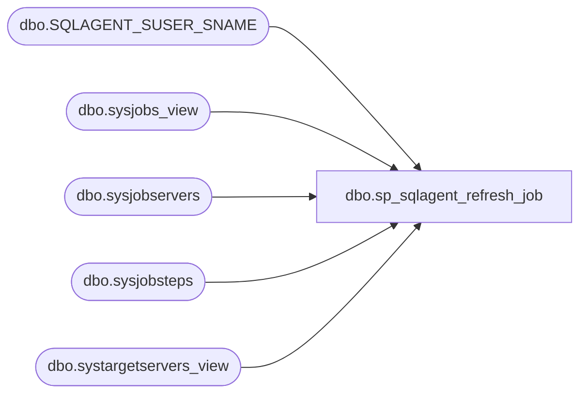

# dbo.sp_sqlagent_refresh_job

**Database:** msdb  
**Server:** bedrockdb02  

## Architecture Diagram



## Table Dependencies

| Referenced Table |
|---|
| dbo.SQLAGENT_SUSER_SNAME |
| dbo.sysjobs_view |
| dbo.sysjobservers |
| dbo.sysjobsteps |
| dbo.systargetservers_view |

## Stored Procedure Code

```sql
CREATE PROCEDURE sp_sqlagent_refresh_job
  @job_id      UNIQUEIDENTIFIER = NULL,
  @server_name sysname          = NULL -- This parameter allows a TSX to use this SP when updating a job
AS
BEGIN
  DECLARE @server_id INT

  SET NOCOUNT ON

  IF (@server_name IS NULL) OR (UPPER(@server_name collate SQL_Latin1_General_CP1_CS_AS) = '(LOCAL)')
    SELECT @server_name = CONVERT(sysname, SERVERPROPERTY('ServerName'))

  SELECT @server_name = UPPER(@server_name)

  SELECT @server_id = server_id
  FROM msdb.dbo.systargetservers_view
  WHERE (UPPER(server_name) = ISNULL(@server_name, UPPER(CONVERT(sysname, SERVERPROPERTY('ServerName')))))

  SELECT @server_id = ISNULL(@server_id, 0)

  SELECT sjv.job_id,
         sjv.name,
         sjv.enabled,
         sjv.start_step_id,
         owner = dbo.SQLAGENT_SUSER_SNAME(sjv.owner_sid),
         sjv.notify_level_eventlog,
         sjv.notify_level_email,
         sjv.notify_level_netsend,
         sjv.notify_level_page,
         sjv.notify_email_operator_id,
         sjv.notify_netsend_operator_id,
         sjv.notify_page_operator_id,
         sjv.delete_level,
         has_step = (SELECT COUNT(*)
                     FROM msdb.dbo.sysjobsteps sjst
                     WHERE (sjst.job_id = sjv.job_id)),
         sjv.version_number,
         last_run_date = ISNULL(sjs.last_run_date, 0),
         last_run_time = ISNULL(sjs.last_run_time, 0),
         sjv.originating_server,
         sjv.description,
         agent_account = CASE sjv.owner_sid
              WHEN 0xFFFFFFFF THEN 1
              ELSE                 0
         END
  FROM msdb.dbo.sysjobservers sjs,
       msdb.dbo.sysjobs_view  sjv
  WHERE ((@job_id IS NULL) OR (@job_id = sjv.job_id))
    AND (sjv.job_id = sjs.job_id)
    AND (sjs.server_id = @server_id)
  ORDER BY sjv.job_id
  OPTION (FORCE ORDER)

  RETURN(@@error) -- 0 means success
END
```

