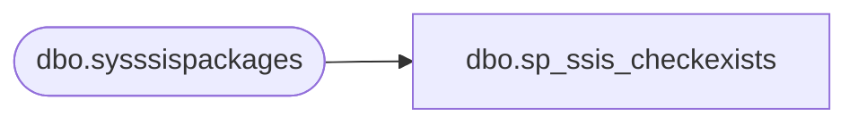

# dbo.sp_ssis_checkexists

**Database:** msdb  
**Server:** bedrockdb02  

## Architecture Diagram



## Table Dependencies

| Referenced Table |
|---|
| dbo.sysssispackages |

## Stored Procedure Code

```sql
CREATE PROCEDURE [dbo].[sp_ssis_checkexists]
  @name sysname,
  @folderid uniqueidentifier
AS
  SET NOCOUNT ON
  SELECT TOP 1 1 FROM sysssispackages WHERE [name] = @name AND [folderid] = @folderid
  RETURN 0    -- SUCCESS
```

