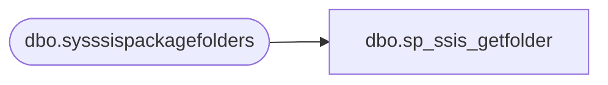

# dbo.sp_ssis_getfolder

**Database:** msdb  
**Server:** bedrockdb02  

## Architecture Diagram



## Table Dependencies

| Referenced Table |
|---|
| dbo.sysssispackagefolders |

## Stored Procedure Code

```sql
CREATE PROCEDURE [dbo].[sp_ssis_getfolder]
  @name sysname,
  @parentfolderid uniqueidentifier
AS
  SELECT
   folder.folderid,
   folder.foldername,
   folder.parentfolderid,
   parent.foldername
  FROM
      sysssispackagefolders folder 
  LEFT OUTER JOIN 
      sysssispackagefolders parent
  ON
      folder.parentfolderid = parent.folderid
  WHERE
      folder.foldername = @name AND
      (folder.parentfolderid = @parentfolderid OR 
      (@parentfolderid IS NULL AND folder.parentfolderid IS NULL))
```

