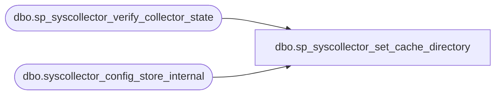

# dbo.sp_syscollector_set_cache_directory

**Database:** msdb  
**Server:** bedrockdb02  

## Architecture Diagram



## Table Dependencies

| Referenced Table |
|---|
| dbo.sp_syscollector_verify_collector_state |
| dbo.syscollector_config_store_internal |

## Stored Procedure Code

```sql
CREATE PROCEDURE [dbo].[sp_syscollector_set_cache_directory]
    @cache_directory                    nvarchar(255) = NULL
AS
BEGIN
    -- Security check (role membership)
    IF (NOT (ISNULL(IS_MEMBER(N'dc_admin'), 0) = 1) AND NOT (ISNULL(IS_MEMBER(N'db_owner'), 0) = 1))
    BEGIN
        RAISERROR(14677, -1, -1, 'dc_admin')
        RETURN(1) -- Failure
    END

    SET @cache_directory = NULLIF(LTRIM(RTRIM(@cache_directory)), N'')

    -- Check if the collector is disabled
    DECLARE @retVal int
    EXEC @retVal = [dbo].[sp_syscollector_verify_collector_state] @desired_state = 0
    IF (@retVal <> 0)
        RETURN (1)

    UPDATE [msdb].[dbo].[syscollector_config_store_internal]
    SET parameter_value = @cache_directory
    WHERE parameter_name = N'CacheDirectory'

    RETURN (0)
END
```

