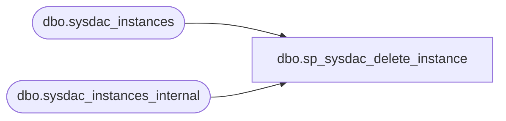

# dbo.sp_sysdac_delete_instance

**Database:** msdb  
**Server:** bedrockdb02  

## Architecture Diagram



## Table Dependencies

| Referenced Table |
|---|
| dbo.sysdac_instances |
| dbo.sysdac_instances_internal |

## Stored Procedure Code

```sql
CREATE PROCEDURE [dbo].[sp_sysdac_delete_instance]  
    @instance_id UniqueIdentifier
AS  
SET NOCOUNT ON;
BEGIN  
    DECLARE @retval INT  
    DECLARE @partId INT

    IF @instance_id IS NULL
    BEGIN
        RAISERROR(14043, -1, -1, 'instance_id', 'sp_sysdac_delete_instance')
        RETURN(1)
    END
  
    -- Ensure that the package being referred to exists by using the package view. We only continue if we can see 
    -- the specified package. The package will only be visible if we are the associated dbo or sysadmin and it exists
    IF NOT EXISTS (SELECT * from dbo.sysdac_instances WHERE instance_id = @instance_id)
    BEGIN
        RAISERROR(36004, -1, -1)
        RETURN(1)
    END
    
    --Delete the entry of DacInstance
    DELETE FROM sysdac_instances_internal WHERE instance_id=@instance_id 

    SELECT @retval = @@error
    RETURN(@retval)
END
```

