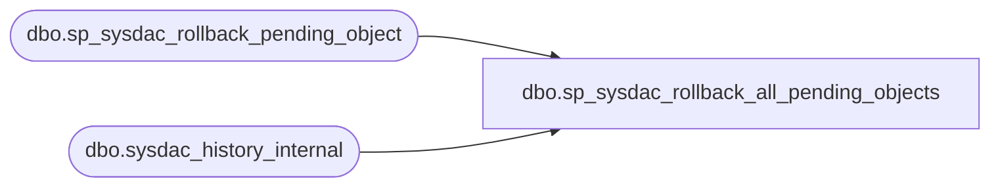

# dbo.sp_sysdac_rollback_all_pending_objects

**Database:** msdb  
**Server:** bedrockdb02  

## Architecture Diagram



## Table Dependencies

| Referenced Table |
|---|
| dbo.sp_sysdac_rollback_pending_object |
| dbo.sysdac_history_internal |

## Stored Procedure Code

```sql
CREATE PROCEDURE [dbo].[sp_sysdac_rollback_all_pending_objects] (@return_scripts TINYINT = 0)
AS  
SET NOCOUNT ON;
BEGIN  
    DECLARE @action_id INT
    DECLARE @sequence_id INT

    --Below are the constants set based on history table    
    DECLARE @header_id bit
    DECLARE @pending TINYINT

    SET @header_id = 0
    SET @pending = 1
    
    CREATE TABLE #additional_scripts(databasename sysname, sqlscript VARCHAR(MAX))
    
    WHILE EXISTS (SELECT 1 FROM sysdac_history_internal WHERE sequence_id = @header_id AND action_status = @pending)
    BEGIN
        SET @action_id = (SELECT TOP 1 action_id FROM sysdac_history_internal WHERE sequence_id = @header_id AND action_status = @pending)

        INSERT INTO #additional_scripts
        EXEC dbo.sp_sysdac_rollback_pending_object @action_id = @action_id
    END
    
    IF (@return_scripts = 1)
    BEGIN
        SELECT databasename, sqlscript FROM #additional_scripts
    END
END
```

