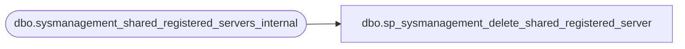

# dbo.sp_sysmanagement_delete_shared_registered_server

**Database:** msdb  
**Server:** bedrockdb02  

## Architecture Diagram



## Table Dependencies

| Referenced Table |
|---|
| dbo.sysmanagement_shared_registered_servers_internal |

## Stored Procedure Code

```sql
CREATE PROCEDURE [dbo].[sp_sysmanagement_delete_shared_registered_server]
    @server_id INT
AS
BEGIN
    IF NOT EXISTS (SELECT * FROM [msdb].[dbo].[sysmanagement_shared_registered_servers_internal] WHERE server_id = @server_id)
    BEGIN
        RAISERROR (35007, -1, -1)
        RETURN(1)
    END
    
    DELETE FROM [msdb].[dbo].[sysmanagement_shared_registered_servers_internal]
    WHERE
            server_id = @server_id
    RETURN (0)
END
```

