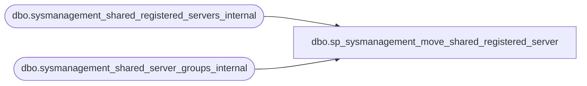

# dbo.sp_sysmanagement_move_shared_registered_server

**Database:** msdb  
**Server:** bedrockdb02  

## Architecture Diagram



## Table Dependencies

| Referenced Table |
|---|
| dbo.sysmanagement_shared_registered_servers_internal |
| dbo.sysmanagement_shared_server_groups_internal |

## Stored Procedure Code

```sql
CREATE PROCEDURE [dbo].[sp_sysmanagement_move_shared_registered_server]
    @server_id INT,
    @new_parent_id INT
AS
BEGIN
    IF (@server_id IS NULL)
    BEGIN
        RAISERROR (35006, -1, -1)
        RETURN(1)
    END
    
    IF NOT EXISTS (SELECT * FROM [msdb].[dbo].[sysmanagement_shared_registered_servers_internal] WHERE server_id = @server_id)
    BEGIN
        RAISERROR (35007, -1, -1)
        RETURN(1)
    END
    
    IF (@new_parent_id IS NULL) OR 
        NOT EXISTS (SELECT * FROM [msdb].[dbo].[sysmanagement_shared_server_groups_internal] WHERE server_group_id = @new_parent_id)
    BEGIN
        RAISERROR (35001, -1, -1)
        RETURN(1)
    END

    IF (@new_parent_id IS NOT NULL)
        AND ((SELECT server_type FROM [msdb].[dbo].[sysmanagement_shared_server_groups_internal] WHERE server_group_id = @new_parent_id)
                <>
             (SELECT server_type FROM [msdb].[dbo].[sysmanagement_shared_registered_servers_internal] WHERE server_id = @server_id))
    BEGIN
        RAISERROR (35002, -1, -1)
        RETURN(1)
    END
    
    UPDATE [msdb].[dbo].[sysmanagement_shared_registered_servers_internal]
        SET server_group_id = @new_parent_id
    WHERE
        server_id = @server_id
    RETURN (0)
END
```

