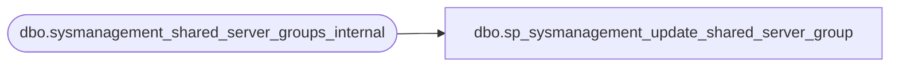

# dbo.sp_sysmanagement_update_shared_server_group

**Database:** msdb  
**Server:** bedrockdb02  

## Architecture Diagram



## Table Dependencies

| Referenced Table |
|---|
| dbo.sysmanagement_shared_server_groups_internal |

## Stored Procedure Code

```sql
CREATE PROCEDURE [dbo].[sp_sysmanagement_update_shared_server_group]
    @server_group_id INT,
    @description NVARCHAR (2048) = NULL
AS
BEGIN
    IF (@server_group_id IS NULL)
    BEGIN
        RAISERROR (35005, -1, -1)
        RETURN(1)
    END

    IF NOT EXISTS (SELECT * FROM [msdb].[dbo].[sysmanagement_shared_server_groups_internal] WHERE server_group_id = @server_group_id)
    BEGIN
        RAISERROR (35004, -1, -1)
        RETURN(1)
    END

    UPDATE [msdb].[dbo].[sysmanagement_shared_server_groups_internal]
        SET description = ISNULL(@description, description)
    WHERE
        server_group_id = @server_group_id
    
    RETURN (0)
END
```

