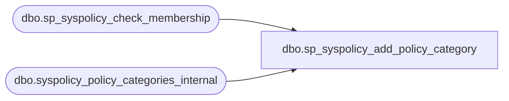

# dbo.sp_syspolicy_add_policy_category

**Database:** msdb  
**Server:** bedrockdb02  

## Architecture Diagram



## Table Dependencies

| Referenced Table |
|---|
| dbo.sp_syspolicy_check_membership |
| dbo.syspolicy_policy_categories_internal |

## Stored Procedure Code

```sql
CREATE PROCEDURE [dbo].[sp_syspolicy_add_policy_category]
@name sysname,
@mandate_database_subscriptions bit = 1,
@policy_category_id int OUTPUT 
AS
BEGIN
	DECLARE @retval_check int;
	EXECUTE @retval_check = [dbo].[sp_syspolicy_check_membership] 'PolicyAdministratorRole'
	IF ( 0!= @retval_check)
	BEGIN
		RETURN @retval_check
	END

	DECLARE @retval			INT
	DECLARE @null_column	sysname
	
	SET @null_column = NULL
	
	IF(@name IS NULL OR @name = N'')
		SET @null_column = '@name'

    IF @null_column IS NOT NULL
    BEGIN
        RAISERROR(14043, -1, -1, @null_column, 'sp_syspolicy_add_policy_category')
        RETURN(1)
    END

    IF EXISTS (SELECT * FROM msdb.dbo.syspolicy_policy_categories_internal WHERE name = @name)
    BEGIN
        RAISERROR(34010, -1, -1, 'Policy Category', @name)
        RETURN(1)
    END

    INSERT INTO msdb.dbo.syspolicy_policy_categories_internal(name, mandate_database_subscriptions) VALUES (@name, @mandate_database_subscriptions)
    SELECT @retval = @@error
    SET @policy_category_id = SCOPE_IDENTITY()
    RETURN(@retval)
END
```

