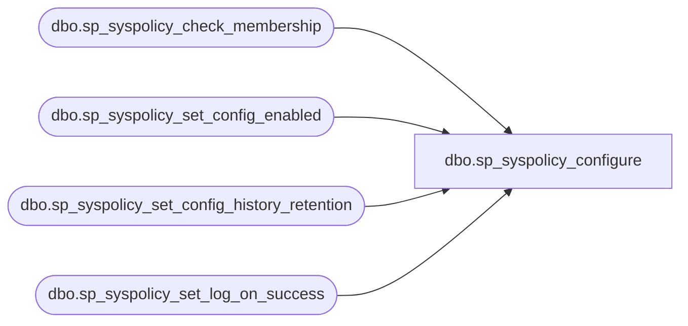

# dbo.sp_syspolicy_configure

**Database:** msdb  
**Server:** bedrockdb02  

## Architecture Diagram



## Table Dependencies

| Referenced Table |
|---|
| dbo.sp_syspolicy_check_membership |
| dbo.sp_syspolicy_set_config_enabled |
| dbo.sp_syspolicy_set_config_history_retention |
| dbo.sp_syspolicy_set_log_on_success |

## Stored Procedure Code

```sql
CREATE PROCEDURE [dbo].[sp_syspolicy_configure]
    @name sysname,
    @value sql_variant
AS
BEGIN
	DECLARE @retval_check int;
	EXECUTE @retval_check = [dbo].[sp_syspolicy_check_membership] 'PolicyAdministratorRole'
	IF (0 != @retval_check)
	BEGIN
		RETURN @retval_check
	END

    DECLARE @value_type sysname;
    
    IF (@name=N'Enabled')
    BEGIN
        SET @value_type = CONVERT(sysname, SQL_VARIANT_PROPERTY(@value, 'BaseType'));
        IF (@value_type != 'int')
        BEGIN
            RAISERROR (34021, -1, -1, @name, @value_type);
            RETURN 34021;
        END
       
        EXEC msdb.[dbo].[sp_syspolicy_set_config_enabled] @value;
    END
    ELSE 
    IF (@name = N'HistoryRetentionInDays')
    BEGIN
        SET @value_type = CONVERT(sysname, SQL_VARIANT_PROPERTY(@value, 'BaseType'));
        IF (@value_type != 'int')
        BEGIN
            RAISERROR (34021, -1, -1, @name, @value_type);
            RETURN 34021;
        END
        
        EXEC msdb.[dbo].[sp_syspolicy_set_config_history_retention] @value;
    END
    ELSE
    IF (@name=N'LogOnSuccess')
    BEGIN
        SET @value_type = CONVERT(sysname, SQL_VARIANT_PROPERTY(@value, 'BaseType'));
        IF (@value_type != 'int')
        BEGIN
            RAISERROR (34021, -1, -1, @name, @value_type);
            RETURN 34021;
        END
       
        EXEC msdb.[dbo].[sp_syspolicy_set_log_on_success] @value;
    END
    ELSE 
    BEGIN
        RAISERROR(34020, -1, -1, @name);
        RETURN 34020;
    END
    
    RETURN 0;
END
```

