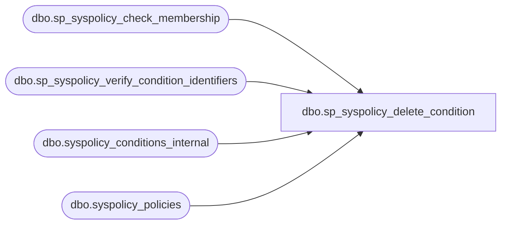

# dbo.sp_syspolicy_delete_condition

**Database:** msdb  
**Server:** bedrockdb02  

## Architecture Diagram



## Table Dependencies

| Referenced Table |
|---|
| dbo.sp_syspolicy_check_membership |
| dbo.sp_syspolicy_verify_condition_identifiers |
| dbo.syspolicy_conditions_internal |
| dbo.syspolicy_policies |

## Stored Procedure Code

```sql
CREATE PROCEDURE [dbo].[sp_syspolicy_delete_condition] 
@name sysname = NULL,
@condition_id int = NULL
AS
BEGIN
	DECLARE @retval_check int;
	EXECUTE @retval_check = [dbo].[sp_syspolicy_check_membership] 'PolicyAdministratorRole'
	IF ( 0!= @retval_check)
	BEGIN
		RETURN @retval_check
	END

	DECLARE @retval              INT

    EXEC @retval = sp_syspolicy_verify_condition_identifiers @name, @condition_id OUTPUT
    IF (@retval <> 0)
        RETURN (1)

    IF EXISTS (SELECT * FROM msdb.dbo.syspolicy_policies WHERE condition_id = @condition_id)
    BEGIN
        RAISERROR(34012,-1,-1,'Condition','Policy')
        RETURN (1)
    END

    DELETE msdb.dbo.syspolicy_conditions_internal
    WHERE condition_id = @condition_id
    
    RETURN (0)
END
```

