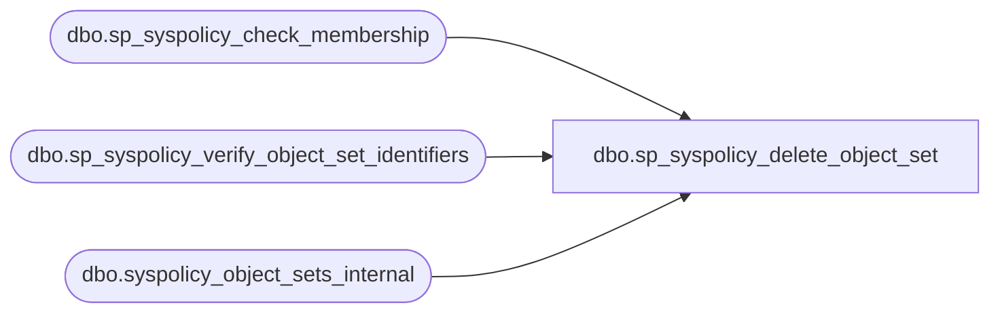

# dbo.sp_syspolicy_delete_object_set

**Database:** msdb  
**Server:** bedrockdb02  

## Architecture Diagram



## Table Dependencies

| Referenced Table |
|---|
| dbo.sp_syspolicy_check_membership |
| dbo.sp_syspolicy_verify_object_set_identifiers |
| dbo.syspolicy_object_sets_internal |

## Stored Procedure Code

```sql
CREATE PROCEDURE [dbo].[sp_syspolicy_delete_object_set]
@object_set_name sysname = NULL,
@object_set_id int = NULL
AS
BEGIN
	DECLARE @retval_check int;
	EXECUTE @retval_check = [dbo].[sp_syspolicy_check_membership] 'PolicyAdministratorRole'
	IF ( 0!= @retval_check)
	BEGIN
		RETURN @retval_check
	END

	DECLARE @retval              INT

    EXEC @retval = sp_syspolicy_verify_object_set_identifiers @object_set_name, @object_set_id OUTPUT
    IF (@retval <> 0)
        RETURN (1)

    DELETE msdb.[dbo].[syspolicy_object_sets_internal] 
        WHERE object_set_id = @object_set_id

    RETURN (0)
END
```

