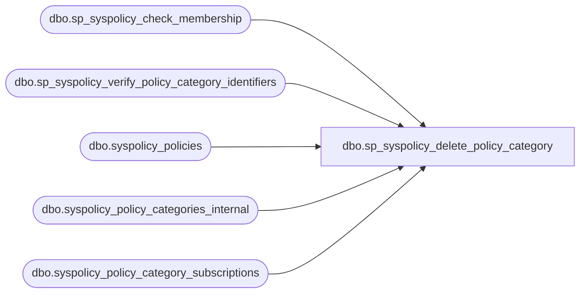

# dbo.sp_syspolicy_delete_policy_category

**Database:** msdb  
**Server:** bedrockdb02  

## Architecture Diagram



## Table Dependencies

| Referenced Table |
|---|
| dbo.sp_syspolicy_check_membership |
| dbo.sp_syspolicy_verify_policy_category_identifiers |
| dbo.syspolicy_policies |
| dbo.syspolicy_policy_categories_internal |
| dbo.syspolicy_policy_category_subscriptions |

## Stored Procedure Code

```sql
CREATE PROCEDURE [dbo].[sp_syspolicy_delete_policy_category]
@name sysname = NULL,
@policy_category_id int = NULL
AS
BEGIN
	DECLARE @retval_check int;
	EXECUTE @retval_check = [dbo].[sp_syspolicy_check_membership] 'PolicyAdministratorRole'
	IF ( 0!= @retval_check)
	BEGIN
		RETURN @retval_check
	END

	DECLARE @retval              INT

    EXEC @retval = sp_syspolicy_verify_policy_category_identifiers @name, @policy_category_id OUTPUT
    IF (@retval <> 0)
        RETURN (1)

    IF EXISTS (SELECT * FROM msdb.dbo.syspolicy_policy_category_subscriptions WHERE policy_category_id = @policy_category_id)
    BEGIN
        RAISERROR(34012,-1,-1,'Policy Category','Policy Subscription')
        RETURN (1)
    END


    IF EXISTS (SELECT * FROM msdb.dbo.syspolicy_policies WHERE policy_category_id = @policy_category_id)
    BEGIN
        RAISERROR(34012,-1,-1,'Policy Category','Policy')
        RETURN (1)
    END

    DELETE msdb.dbo.syspolicy_policy_categories_internal
    WHERE policy_category_id = @policy_category_id
    
    SET @retval = @@error
    RETURN @retval
END
```

