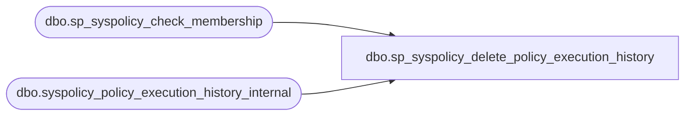

# dbo.sp_syspolicy_delete_policy_execution_history

**Database:** msdb  
**Server:** bedrockdb02  

## Architecture Diagram



## Table Dependencies

| Referenced Table |
|---|
| dbo.sp_syspolicy_check_membership |
| dbo.syspolicy_policy_execution_history_internal |

## Stored Procedure Code

```sql
CREATE PROC [dbo].[sp_syspolicy_delete_policy_execution_history] 
 @policy_id int,
 @oldest_date datetime
AS
BEGIN
	DECLARE @retval_check int;
	EXECUTE @retval_check = [dbo].[sp_syspolicy_check_membership] 'PolicyAdministratorRole'
	IF ( 0!= @retval_check)
	BEGIN
		RETURN @retval_check
	END

    IF @oldest_date IS NULL
        BEGIN
        IF (@policy_id IS NULL)
            DELETE syspolicy_policy_execution_history_internal
        ELSE
            DELETE syspolicy_policy_execution_history_internal WHERE policy_id = @policy_id
        END
    ELSE
        BEGIN
        IF (@policy_id IS NULL)
            DELETE syspolicy_policy_execution_history_internal WHERE start_date < @oldest_date
        ELSE
            DELETE syspolicy_policy_execution_history_internal WHERE policy_id = @policy_id AND start_date < @oldest_date
        END
END
```

