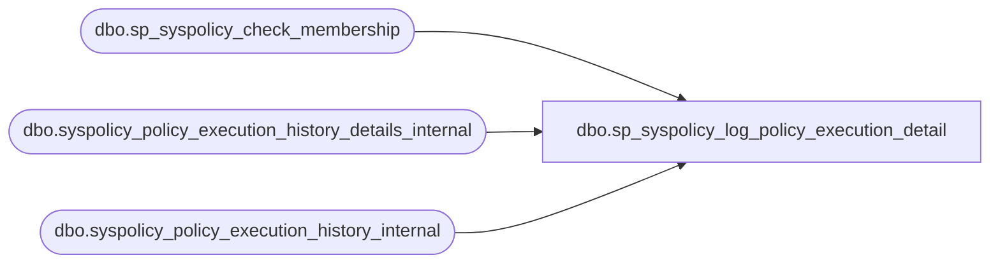

# dbo.sp_syspolicy_log_policy_execution_detail

**Database:** msdb  
**Server:** bedrockdb02  

## Architecture Diagram



## Table Dependencies

| Referenced Table |
|---|
| dbo.sp_syspolicy_check_membership |
| dbo.syspolicy_policy_execution_history_details_internal |
| dbo.syspolicy_policy_execution_history_internal |

## Stored Procedure Code

```sql
CREATE PROC [dbo].[sp_syspolicy_log_policy_execution_detail] 
 @history_id bigint, 
 @target_query_expression nvarchar(4000), 
 @target_query_expression_with_id nvarchar(4000), 
 @result bit, 
 @result_detail nvarchar(max),
 @exception_message nvarchar(max) = NULL,
 @exception nvarchar(max) = NULL
AS
BEGIN
	DECLARE @retval_check int;
	EXECUTE @retval_check = [dbo].[sp_syspolicy_check_membership] 'PolicyAdministratorRole', 0
	IF ( 0!= @retval_check)
	BEGIN
		RETURN @retval_check
	END
    BEGIN TRANSACTION
    DECLARE @is_valid_entry INT
    -- take an update lock on this table first to prevent deadlock
    SELECT @is_valid_entry = count(*) FROM syspolicy_policy_execution_history_internal
        WITH (UPDLOCK) 
        WHERE history_id = @history_id

    INSERT syspolicy_policy_execution_history_details_internal (
                                history_id, 
                                target_query_expression, 
                                target_query_expression_with_id, 
                                result, 
                                result_detail,
                                exception_message,
                                exception) 
                        VALUES (
                                @history_id, 
                                @target_query_expression, 
                                @target_query_expression_with_id, 
                                @result, 
                                @result_detail,
                                @exception_message,
                                @exception) 
    IF( @@TRANCOUNT > 0)
        COMMIT
END
```

