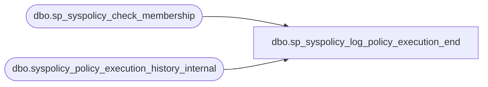

# dbo.sp_syspolicy_log_policy_execution_end

**Database:** msdb  
**Server:** bedrockdb02  

## Architecture Diagram



## Table Dependencies

| Referenced Table |
|---|
| dbo.sp_syspolicy_check_membership |
| dbo.syspolicy_policy_execution_history_internal |

## Stored Procedure Code

```sql
CREATE PROC [dbo].[sp_syspolicy_log_policy_execution_end] 
    @history_id bigint, 
    @result bit,
    @exception_message nvarchar(max) = NULL,
    @exception nvarchar(max) = NULL
AS
BEGIN
	DECLARE @retval_check int;
	EXECUTE @retval_check = [dbo].[sp_syspolicy_check_membership] 'PolicyAdministratorRole', 0
	IF ( 0!= @retval_check)
	BEGIN
		RETURN @retval_check
	END

    UPDATE syspolicy_policy_execution_history_internal 
      SET result = @result,
          end_date = GETDATE(),
          exception_message = @exception_message,
          exception = @exception
      WHERE history_id = @history_id
END
```

