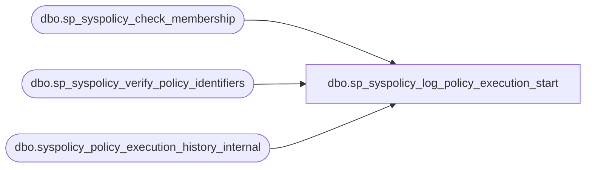

# dbo.sp_syspolicy_log_policy_execution_start

**Database:** msdb  
**Server:** bedrockdb02  

## Architecture Diagram



## Table Dependencies

| Referenced Table |
|---|
| dbo.sp_syspolicy_check_membership |
| dbo.sp_syspolicy_verify_policy_identifiers |
| dbo.syspolicy_policy_execution_history_internal |

## Stored Procedure Code

```sql
CREATE PROC [dbo].[sp_syspolicy_log_policy_execution_start] 
    @policy_id int,
    @is_full_run bit,
    @history_id bigint OUTPUT 
AS
BEGIN
	DECLARE @retval_check int;
	EXECUTE @retval_check = [dbo].[sp_syspolicy_check_membership] 'PolicyAdministratorRole', 0
	IF ( 0!= @retval_check)
	BEGIN
		RETURN @retval_check
	END
    DECLARE @ret int

    SET @history_id = 0

    EXEC @ret = dbo.sp_syspolicy_verify_policy_identifiers NULL, @policy_id
    IF @ret <> 0 RETURN -1

    INSERT syspolicy_policy_execution_history_internal (policy_id, is_full_run) VALUES (@policy_id, @is_full_run) 
    SET @history_id = SCOPE_IDENTITY ()
END
```

