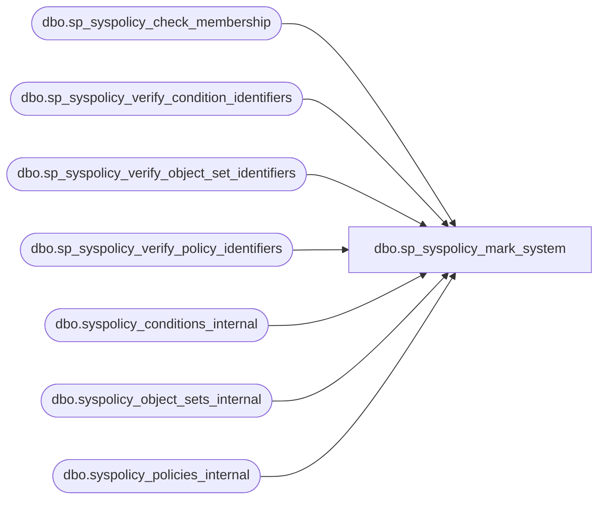

# dbo.sp_syspolicy_mark_system

**Database:** msdb  
**Server:** bedrockdb02  

## Architecture Diagram



## Table Dependencies

| Referenced Table |
|---|
| dbo.sp_syspolicy_check_membership |
| dbo.sp_syspolicy_verify_condition_identifiers |
| dbo.sp_syspolicy_verify_object_set_identifiers |
| dbo.sp_syspolicy_verify_policy_identifiers |
| dbo.syspolicy_conditions_internal |
| dbo.syspolicy_object_sets_internal |
| dbo.syspolicy_policies_internal |

## Stored Procedure Code

```sql
CREATE PROC dbo.sp_syspolicy_mark_system @type sysname, @name sysname=NULL, @object_id int=NULL, @marker bit=NULL 
AS
BEGIN
	-- If @marker IS NULL simple return the state

    DECLARE @retval_check int;
    EXECUTE @retval_check = [dbo].[sp_syspolicy_check_membership] 'PolicyAdministratorRole'
    IF ( 0!= @retval_check)
    BEGIN
        RETURN @retval_check
    END

	DECLARE @retval int
	
	IF (UPPER(@type  collate SQL_Latin1_General_CP1_CS_AS) = N'POLICY')
	BEGIN
	    EXEC @retval = sp_syspolicy_verify_policy_identifiers @name, @object_id OUTPUT
		IF (@retval <> 0)
			RETURN (1)

		IF @marker IS NULL
		BEGIN
			SELECT policy_id, name, is_system FROM syspolicy_policies_internal WHERE policy_id = @object_id
		END
		ELSE
		BEGIN
			UPDATE msdb.dbo.syspolicy_policies_internal
			SET is_system = @marker 
			WHERE policy_id = @object_id
		END
	END
	ELSE IF (UPPER(@type collate SQL_Latin1_General_CP1_CS_AS) = N'CONDITION')
	BEGIN
	    EXEC @retval = sp_syspolicy_verify_condition_identifiers @name, @object_id OUTPUT
		IF (@retval <> 0)
			RETURN (1)

		IF @marker IS NULL
		BEGIN
			SELECT condition_id, name, is_system FROM syspolicy_conditions_internal WHERE condition_id = @object_id
		END
		ELSE
		BEGIN
			UPDATE msdb.dbo.syspolicy_conditions_internal
			SET is_system = @marker 
			WHERE condition_id = @object_id
		END
	END
	ELSE IF (UPPER(@type collate SQL_Latin1_General_CP1_CS_AS) = N'OBJECTSET')
	BEGIN
	    EXEC @retval = sp_syspolicy_verify_object_set_identifiers @name, @object_id OUTPUT
		IF (@retval <> 0)
			RETURN (1)

		IF @marker IS NULL
		BEGIN
			SELECT object_set_id, object_set_name, is_system FROM syspolicy_object_sets_internal WHERE object_set_id = @object_id
		END
		ELSE
		BEGIN
			UPDATE msdb.dbo.syspolicy_object_sets_internal
			SET is_system = @marker 
			WHERE object_set_id = @object_id
		END
	END
    ELSE
    BEGIN
		RAISERROR(14262, -1, -1, '@type', @type)
		RETURN(1) -- Failure
	END
	
    SELECT @retval = @@error
    RETURN(@retval)
END
```

