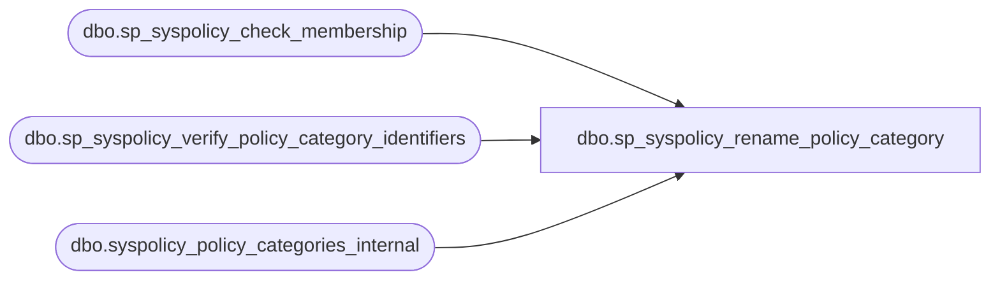

# dbo.sp_syspolicy_rename_policy_category

**Database:** msdb  
**Server:** bedrockdb02  

## Architecture Diagram



## Table Dependencies

| Referenced Table |
|---|
| dbo.sp_syspolicy_check_membership |
| dbo.sp_syspolicy_verify_policy_category_identifiers |
| dbo.syspolicy_policy_categories_internal  |

## Stored Procedure Code

```sql
CREATE PROCEDURE [dbo].[sp_syspolicy_rename_policy_category] 
@name sysname = NULL,
@policy_category_id int = NULL,
@new_name sysname = NULL
AS
BEGIN
	DECLARE @retval_check int;
	EXECUTE @retval_check = [dbo].[sp_syspolicy_check_membership] 'PolicyAdministratorRole'
	IF ( 0!= @retval_check)
	BEGIN
		RETURN @retval_check
	END

    IF (@new_name IS NULL or LEN(@new_name) = 0)
    BEGIN
      RAISERROR(21263, -1, -1, '@new_name')
      RETURN(1) -- Failure
    END

    DECLARE @retval              INT

    EXEC @retval = sp_syspolicy_verify_policy_category_identifiers @name, @policy_category_id OUTPUT
    IF (@retval <> 0)
        RETURN (1)

    UPDATE msdb.[dbo].[syspolicy_policy_categories_internal ]
    SET name = @new_name
    WHERE policy_category_id = @policy_category_id

    SELECT @retval = @@error
    RETURN(@retval)
END
```

