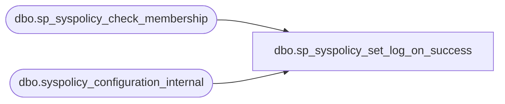

# dbo.sp_syspolicy_set_log_on_success

**Database:** msdb  
**Server:** bedrockdb02  

## Architecture Diagram



## Table Dependencies

| Referenced Table |
|---|
| dbo.sp_syspolicy_check_membership |
| dbo.syspolicy_configuration_internal |

## Stored Procedure Code

```sql
CREATE PROCEDURE [dbo].[sp_syspolicy_set_log_on_success] 
	@value sql_variant
AS
BEGIN
	DECLARE @retval_check int;
	EXECUTE @retval_check = [dbo].[sp_syspolicy_check_membership] 'PolicyAdministratorRole'
	IF ( 0!= @retval_check)
	BEGIN
		RETURN @retval_check
	END

    UPDATE [msdb].[dbo].[syspolicy_configuration_internal]
        SET current_value = @value
        WHERE name = N'LogOnSuccess';
    
END
```

