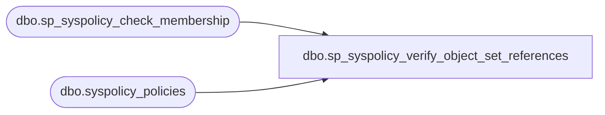

# dbo.sp_syspolicy_verify_object_set_references

**Database:** msdb  
**Server:** bedrockdb02  

## Architecture Diagram



## Table Dependencies

| Referenced Table |
|---|
| dbo.sp_syspolicy_check_membership |
| dbo.syspolicy_policies |

## Stored Procedure Code

```sql
CREATE PROCEDURE [dbo].[sp_syspolicy_verify_object_set_references]
@object_set_id int,
@is_referenced int OUTPUT
AS
BEGIN
	DECLARE @retval_check int;
	EXECUTE @retval_check = [dbo].[sp_syspolicy_check_membership] 'PolicyAdministratorRole'
	IF ( 0!= @retval_check)
	BEGIN
		RETURN @retval_check
	END

	SELECT @is_referenced = count(*) FROM dbo.syspolicy_policies WHERE object_set_id = @object_set_id
END
```

