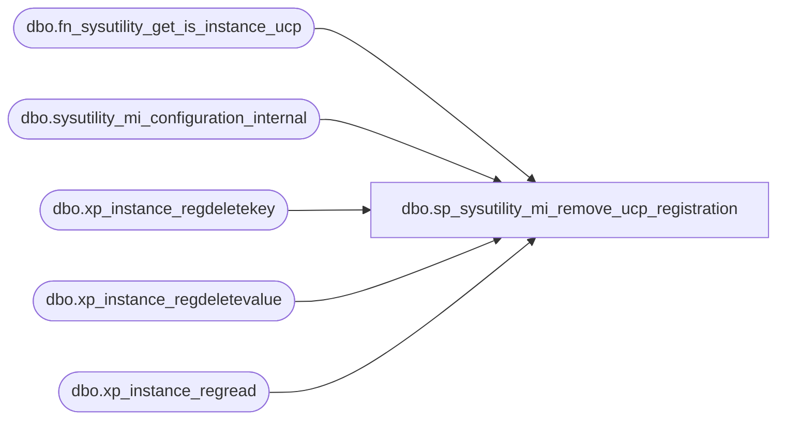

# dbo.sp_sysutility_mi_remove_ucp_registration

**Database:** msdb  
**Server:** bedrockdb02  

## Architecture Diagram



## Table Dependencies

| Referenced Table |
|---|
| dbo.fn_sysutility_get_is_instance_ucp |
| dbo.sysutility_mi_configuration_internal |
| dbo.xp_instance_regdeletekey |
| dbo.xp_instance_regdeletevalue |
| dbo.xp_instance_regread |

## Stored Procedure Code

```sql
CREATE PROCEDURE [dbo].[sp_sysutility_mi_remove_ucp_registration]
WITH EXECUTE AS OWNER
AS
BEGIN
   SET NOCOUNT ON;
   SET XACT_ABORT ON;
 
   BEGIN TRANSACTION;
    
    IF EXISTS (SELECT * FROM [msdb].[dbo].[sysutility_mi_configuration_internal])
    BEGIN
      UPDATE [msdb].[dbo].[sysutility_mi_configuration_internal]
      SET
         ucp_instance_name          = NULL,
         mdw_database_name          = NULL
    END
    ELSE
    BEGIN
         INSERT INTO [msdb].[dbo].[sysutility_mi_configuration_internal] (ucp_instance_name, mdw_database_name)
         VALUES (NULL, NULL);
    END     

   COMMIT TRANSACTION;

   ---- If the above part fails it will not execute the following XPs.
   ---- The following XP calls are not transactional, so they are put outside
   ---- the transaction.
   ---- Remove the MiUcpName registry key if it is present
   DECLARE @mi_ucp_name nvarchar(1024)
   EXEC master.dbo.xp_instance_regread N'HKEY_LOCAL_MACHINE',
                                       N'SOFTWARE\Microsoft\MSSQLServer\MSSQLServer\Utility',
                                       N'MiUcpName',
                                       @mi_ucp_name OUTPUT

   IF @mi_ucp_name IS NOT NULL
   BEGIN
       EXEC master.dbo.xp_instance_regdeletevalue N'HKEY_LOCAL_MACHINE',
                                                  N'SOFTWARE\Microsoft\MSSQLServer\MSSQLServer\Utility',
                                                  N'MiUcpName'
   END

   ---- Remove the registry key if this instance is NOT a UCP.
   ---- If this instance is a UCP we cannot remove the key entirely as
   ---- the version number is still stored under the key.
   IF (msdb.dbo.fn_sysutility_get_is_instance_ucp() = 0)
   BEGIN
       EXEC master.dbo.xp_instance_regdeletekey N'HKEY_LOCAL_MACHINE',
                                                  N'SOFTWARE\Microsoft\MSSQLServer\MSSQLServer\Utility'
   END
   
END
```

