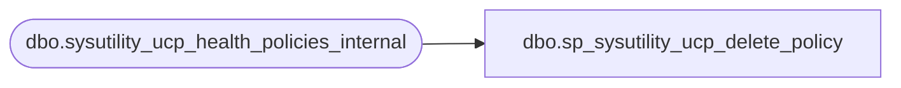

# dbo.sp_sysutility_ucp_delete_policy

**Database:** msdb  
**Server:** bedrockdb02  

## Architecture Diagram



## Table Dependencies

| Referenced Table |
|---|
| dbo.sysutility_ucp_health_policies_internal |

## Stored Procedure Code

```sql
CREATE PROCEDURE [dbo].[sp_sysutility_ucp_delete_policy] 
   @resource_health_policy_id INT
WITH EXECUTE AS OWNER
AS
BEGIN

    DECLARE @retval INT
    DECLARE @null_column    SYSNAME
    
    SET @null_column = NULL

    IF (@resource_health_policy_id IS NULL OR @resource_health_policy_id = 0)
        SET @null_column = '@resource_health_policy_id'

    IF @null_column IS NOT NULL
    BEGIN
        RAISERROR(14043, -1, -1, @null_column, 'sp_sysutility_ucp_delete_policy')
        RETURN(1)
    END

    IF NOT EXISTS (SELECT * FROM dbo.sysutility_ucp_health_policies_internal WHERE health_policy_id = @resource_health_policy_id AND is_global_policy = 0)
    BEGIN
        RAISERROR(22981, -1, -1)
        RETURN(1)
    END

    DELETE dbo.sysutility_ucp_health_policies_internal
    WHERE health_policy_id = @resource_health_policy_id
    
    SELECT @retval = @@error
    RETURN(@retval)
END
```

