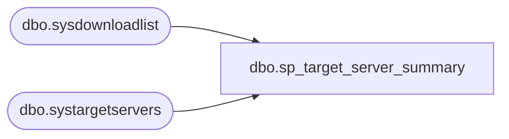

# dbo.sp_target_server_summary

**Database:** msdb  
**Server:** bedrockdb02  

## Architecture Diagram



## Table Dependencies

| Referenced Table |
|---|
| dbo.sysdownloadlist |
| dbo.systargetservers |

## Stored Procedure Code

```sql
CREATE PROCEDURE sp_target_server_summary
  @target_server sysname = NULL
AS
BEGIN
  SET NOCOUNT ON

  SELECT server_id,
         server_name,
        'local_time' = DATEADD(SS, DATEDIFF(SS, last_poll_date, GETDATE()), local_time_at_last_poll),
         last_poll_date,
        'unread_instructions' = (SELECT COUNT(*)
                                 FROM msdb.dbo.sysdownloadlist sdl
                                 WHERE (UPPER(sdl.target_server) = UPPER(sts.server_name))
                                   AND (sdl.status = 0)),
        'blocked' = (SELECT COUNT(*)
                     FROM msdb.dbo.sysdownloadlist sdl
                     WHERE (UPPER(sdl.target_server) = UPPER(sts.server_name))
                       AND (sdl.error_message IS NOT NULL)),
         poll_interval
  FROM msdb.dbo.systargetservers sts
  WHERE ((@target_server IS NULL) OR (UPPER(@target_server) = UPPER(sts.server_name)))
END
```

