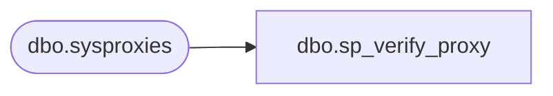

# dbo.sp_verify_proxy

**Database:** msdb  
**Server:** bedrockdb02  

## Architecture Diagram



## Table Dependencies

| Referenced Table |
|---|
| dbo.sysproxies |

## Stored Procedure Code

```sql
CREATE PROCEDURE dbo.sp_verify_proxy
   @proxy_id [INT] = NULL,
   @proxy_name [sysname],
   @enabled [tinyint],
   @description [nvarchar](512) = NULL
AS
BEGIN
  DECLARE @return_code INT
  SET NOCOUNT ON

  -- Check if the NewName is unique
  IF (EXISTS ( SELECT *
               FROM msdb.dbo.sysproxies
               WHERE (name = @proxy_name) AND
            proxy_id <> ISNULL(@proxy_id,0) ))
  BEGIN
    RAISERROR(14261, 16, 1, '@name', @proxy_name)
    RETURN(1) -- Failure
  END

  -- Enabled must be 0 or 1
  IF (@enabled NOT IN (0, 1))
  BEGIN
    RAISERROR(14266, 16, 1, '@enabled', '0, 1')
    RETURN(1) -- Failure
  END
  
  RETURN(0)
END
```

