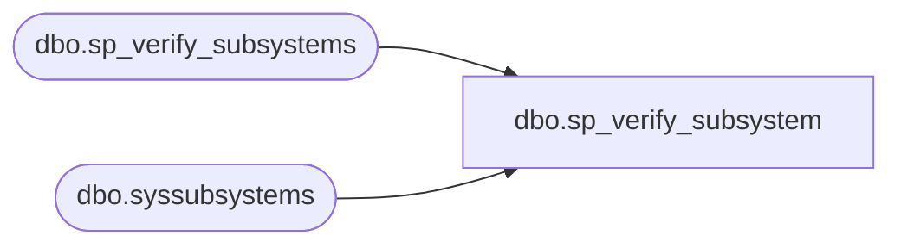

# dbo.sp_verify_subsystem

**Database:** msdb  
**Server:** bedrockdb02  

## Architecture Diagram



## Table Dependencies

| Referenced Table |
|---|
| dbo.sp_verify_subsystems |
| dbo.syssubsystems |

## Stored Procedure Code

```sql
CREATE PROCEDURE sp_verify_subsystem
  @subsystem NVARCHAR(40)
AS
BEGIN
  DECLARE @retval         INT
  SET NOCOUNT ON

  -- this call will populate subsystems table if necessary
  EXEC @retval = msdb.dbo.sp_verify_subsystems
  IF @retval <> 0
     RETURN(@retval)

  -- Remove any leading/trailing spaces from parameters
  SELECT @subsystem = LTRIM(RTRIM(@subsystem))

  -- Make sure Dts is translated into new subsystem's name SSIS
  IF (@subsystem IS NOT NULL AND UPPER(@subsystem collate SQL_Latin1_General_CP1_CS_AS) = N'DTS')
  BEGIN
    SET @subsystem = N'SSIS'
  END

  IF EXISTS (SELECT * FROM syssubsystems 
          WHERE  UPPER(@subsystem collate SQL_Latin1_General_CP1_CS_AS) =
                 UPPER(subsystem collate SQL_Latin1_General_CP1_CS_AS))
    RETURN(0) -- Success
  ELSE
  BEGIN
    RAISERROR(14234, -1, -1, '@subsystem', 'sp_enum_sqlagent_subsystems')
    RETURN(1) -- Failure
  END
END
```

