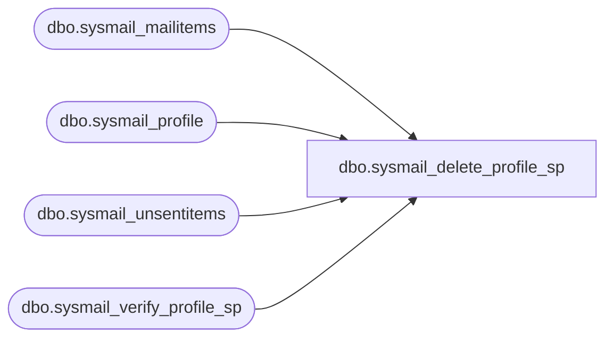

# dbo.sysmail_delete_profile_sp

**Database:** msdb  
**Server:** bedrockdb02  

## Architecture Diagram



## Table Dependencies

| Referenced Table |
|---|
| dbo.sysmail_mailitems |
| dbo.sysmail_profile |
| dbo.sysmail_unsentitems |
| dbo.sysmail_verify_profile_sp |

## Stored Procedure Code

```sql
CREATE PROCEDURE [dbo].[sysmail_delete_profile_sp]
   @profile_id int = NULL, -- must provide either id or name
   @profile_name sysname = NULL,
   @force_delete BIT = 1
AS
   SET NOCOUNT ON
  
   DECLARE @rc int
   DECLARE @profileid int
   exec @rc = msdb.dbo.sysmail_verify_profile_sp @profile_id, @profile_name, 0, 0, @profileid OUTPUT
   IF @rc <> 0
      RETURN(1)

IF(EXISTS (select * from sysmail_unsentitems WHERE 
   sysmail_unsentitems.profile_id = @profileid) AND @force_delete <> 1)
BEGIN
    IF(@profile_name IS NULL)
    BEGIN
        select @profile_name = name from dbo.sysmail_profile WHERE profile_id = @profileid
    END
    RAISERROR(14668, -1, -1, @profile_name)
    RETURN (1)   
END

UPDATE [msdb].[dbo].[sysmail_mailitems]
SET [sent_status] = 2, [sent_date] = getdate()
WHERE profile_id = @profileid AND sent_status <> 1
     
   DELETE FROM msdb.dbo.sysmail_profile 
   WHERE profile_id = @profileid
   RETURN(0)
```

