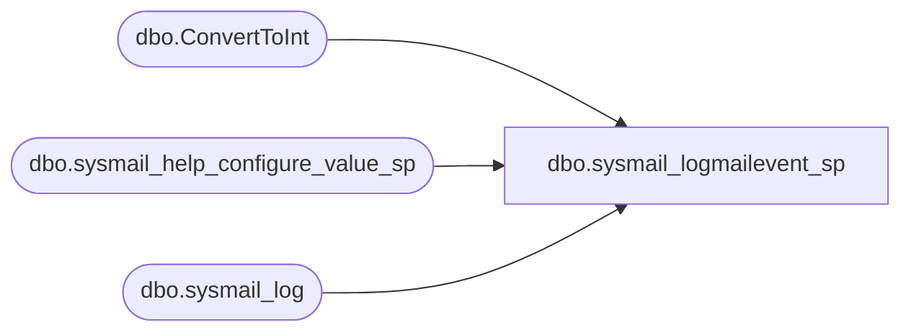

# dbo.sysmail_logmailevent_sp

**Database:** msdb  
**Server:** bedrockdb02  

## Architecture Diagram



## Table Dependencies

| Referenced Table |
|---|
| dbo.ConvertToInt |
| dbo.sysmail_help_configure_value_sp |
| dbo.sysmail_log |

## Stored Procedure Code

```sql
-- sysmail_logmailevent_sp : inserts an entry in the sysmail_log table
CREATE PROCEDURE sysmail_logmailevent_sp
    @event_type     INT,
    @description    NVARCHAR(max)   = NULL, 
    @process_id     INT             = NULL,
    @mailitem_id    INT             = NULL,
    @account_id     INT             = NULL
AS
    SET NOCOUNT ON

    --Try and get the optional logging level for the DatabaseMail process
    DECLARE @loggingLevel nvarchar(256)
    EXEC msdb.dbo.sysmail_help_configure_value_sp @parameter_name = N'LoggingLevel', 
                                                  @parameter_value = @loggingLevel OUTPUT

    DECLARE @loggingLevelInt int   
    SET @loggingLevelInt = dbo.ConvertToInt(@loggingLevel, 3, 2) 

    IF (@event_type = 3) OR                           -- error
       (@event_type = 2 AND @loggingLevelInt >= 2) OR -- warning with extended logging
       (@event_type = 1 AND @loggingLevelInt >= 2) OR -- info with extended logging
       (@event_type = 0 AND @loggingLevelInt >= 3)    -- success with verbose logging
    BEGIN
       INSERT sysmail_log(event_type, description, process_id, mailitem_id, account_id) 
       VALUES(@event_type, @description, @process_id , @mailitem_id, @account_id)
    END
RETURN 0
```

