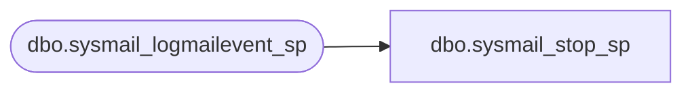

# dbo.sysmail_stop_sp

**Database:** msdb  
**Server:** bedrockdb02  

## Architecture Diagram



## Table Dependencies

| Referenced Table |
|---|
| dbo.sysmail_logmailevent_sp |

## Stored Procedure Code

```sql
-- sysmail_stop_sp : stops the DatabaseMail process. Mail items remain in the queue until sqlmail started 
CREATE PROCEDURE sysmail_stop_sp
AS
    SET NOCOUNT ON
    DECLARE @rc INT
   DECLARE @localmessage nvarchar(255)
  
    ALTER QUEUE ExternalMailQueue WITH ACTIVATION (STATUS = OFF);
    SELECT @rc = @@ERROR
    IF(@rc = 0)
    BEGIN
       ALTER QUEUE ExternalMailQueue WITH STATUS = OFF;
       SELECT @rc = @@ERROR
       IF(@rc = 0)
       BEGIN
          SET @localmessage = FORMATMESSAGE(14640, SUSER_SNAME())
          exec msdb.dbo.sysmail_logmailevent_sp @event_type=1, @description=@localmessage
       END
    END
RETURN @rc
```

