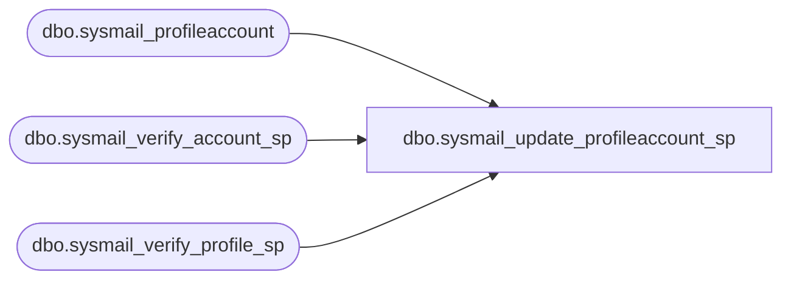

# dbo.sysmail_update_profileaccount_sp

**Database:** msdb  
**Server:** bedrockdb02  

## Architecture Diagram



## Table Dependencies

| Referenced Table |
|---|
| dbo.sysmail_profileaccount |
| dbo.sysmail_verify_account_sp |
| dbo.sysmail_verify_profile_sp |

## Stored Procedure Code

```sql
CREATE PROCEDURE dbo.sysmail_update_profileaccount_sp
   @profile_id int = NULL, -- must provide id or name
   @profile_name sysname = NULL,
   @account_id int = NULL, -- must provide id or name
   @account_name sysname = NULL,
   @sequence_number int -- account with the lowest sequence number is picked as default
AS
   SET NOCOUNT ON

   DECLARE @rc int
   DECLARE @profileid int
   DECLARE @accountid int

   exec @rc = msdb.dbo.sysmail_verify_profile_sp @profile_id, @profile_name, 0, 0, @profileid OUTPUT
   IF @rc <> 0
      RETURN(1)

   exec @rc = msdb.dbo.sysmail_verify_account_sp @account_id, @account_name, 0, 0, @accountid OUTPUT
   IF @rc <> 0
      RETURN(2)

   IF (@sequence_number IS NULL)
   BEGIN
      RAISERROR(14611, -1, -1)   
      RETURN(3)
   END
   
   UPDATE msdb.dbo.sysmail_profileaccount
   SET sequence_number=@sequence_number
   WHERE profile_id=@profileid AND account_id=@accountid
   
   RETURN(0)
```

