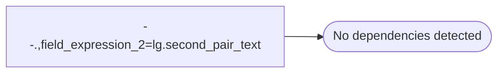

# --.,field_expression_2=lg.second_pair_text

**Database:** smartlook_01  
**Server:** bedrockdb02  

## Architecture Diagram



## Table Dependencies

_No table references detected._

## Stored Procedure Code

```sql

```

