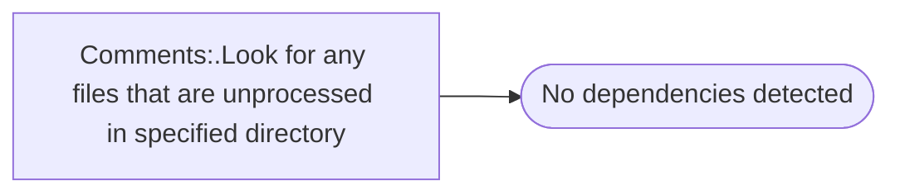

# Comments:.Look for any files that are unprocessed in specified directory

**Database:** smartlook_01  
**Server:** bedrockdb02  

## Architecture Diagram



## Table Dependencies

_No table references detected._

## Stored Procedure Code

```sql

```

