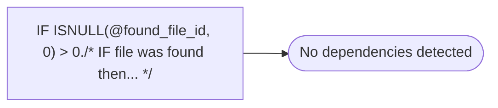

# IF ISNULL(@found_file_id, 0) > 0./* IF file was found then... */

**Database:** smartlook_01  
**Server:** bedrockdb02  

## Architecture Diagram



## Table Dependencies

_No table references detected._

## Stored Procedure Code

```sql

```

